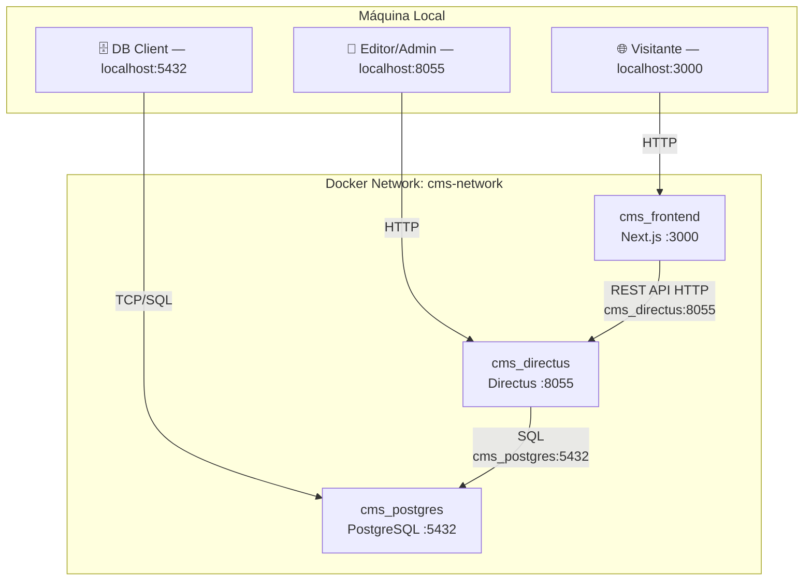
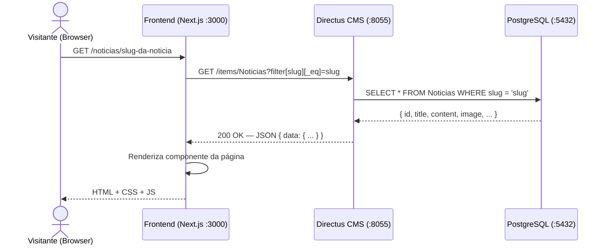
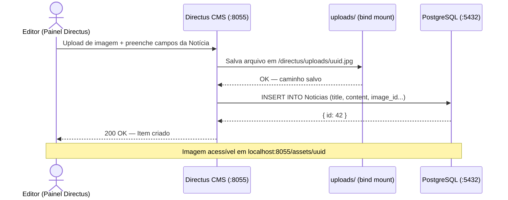
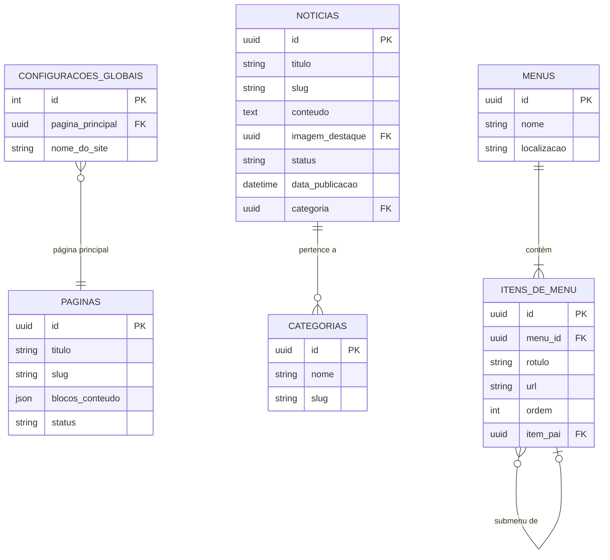

# 🏗️ Arquitetura do Sistema — Headless CMS

Este documento descreve a arquitetura técnica, o fluxo de dados, a topologia dos containers e as decisões de design do projeto.

---

## 📐 Visão Geral

O projeto adota o padrão **JAMstack / Headless CMS**, onde backend (CMS + banco) e frontend são completamente desacoplados, comunicando-se via **HTTP API** (REST ou GraphQL).

---

## 🗺️ Topologia de Containers

---

## 🔄 Fluxo de Dados — Requisição de Página

---

## 🔄 Fluxo — Publicação de Conteúdo pelo Editor

---

## 🗄️ Modelo de Dados (Coleções Planejadas)

---

## 🏛️ Decisões de Arquitetura (ADRs)

| # | Decisão | Alternativas | Justificativa |
|---|---------|-------------|---------------|
| 1 | **Directus** como CMS | Strapi, Sanity | Espelha o schema do PostgreSQL nativamente; suporte a Block Editor + WYSIWYG + HTML livre |
| 2 | **PostgreSQL 16** | MySQL, SQLite | Tipagem forte, suporte a JSON, Full-Text Search e melhor integração com Directus |
| 3 | **Next.js App Router** | Pages Router, Remix | Server Components eliminam waterfalls e reduzem JS no cliente |
| 4 | **Bind-mount** para `uploads/` | Volume nomeado | Facilita backup e inspeção direta dos arquivos no Windows |
| 5 | **CORS no Directus** | Nginx reverso | Mais simples para desenvolvimento local |

---

> Consulte o [`README.md`](./README.md) para instruções de instalação e o [`frontend/DESIGN_SYSTEM.md`](./frontend/DESIGN_SYSTEM.md) para as diretrizes visuais.
