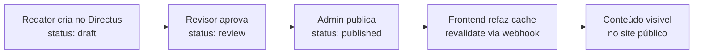

# 📖 Guia de Criação de Conteúdo — RQH Tech Solutions

Este documento é o manual operacional para criar, editar e publicar **Páginas** e **Notícias** no CMS. Inclui o passo a passo no painel do Directus, a estrutura de dados esperada e como cada campo aparece no frontend.

---

## 📚 Sumário

1. [Acessando o Painel do CMS](#1-acessando-o-painel-do-cms)
2. [Estrutura de Coleções](#2-estrutura-de-coleções)
3. [Criando uma Notícia (Blog/Insights)](#3-criando-uma-notícia-bloginsights)
4. [Criando uma Página Institucional](#4-criando-uma-página-institucional)
5. [Gerenciando Mídias (Imagens e Documentos)](#5-gerenciando-mídias-imagens-e-documentos)
6. [Definindo a Página Principal](#6-definindo-a-página-principal)
7. [Como o Frontend Consome o Conteúdo](#7-como-o-frontend-consome-o-conteúdo)
8. [Criando Novas Páginas no Frontend](#8-criando-novas-páginas-no-frontend)
9. [Boas Práticas e Convenções](#9-boas-práticas-e-convenções)

---

## 1. Acessando o Painel do CMS

> [!IMPORTANT]
> O Docker deve estar rodando. Execute `docker compose up -d` na pasta raiz do projeto antes de acessar.

| URL | Função |
|-----|--------|
| `http://localhost:8055` | Painel de administração do Directus |
| `http://localhost:3000` | Frontend Next.js (site público) |

**Credenciais de acesso:**
- **Email:** `admin@admin.com`
- **Senha:** `admin`

---

## 2. Estrutura de Coleções

Antes de criar conteúdo, as seguintes coleções precisam ser criadas no Directus em **Settings → Data Model**.

### Coleção: `noticias`

| Campo | Tipo no Directus | Obrigatório | Descrição |
|-------|-----------------|-------------|-----------|
| `titulo` | Input (Text) | ✅ | Título da notícia |
| `slug` | Input (Text) | ✅ | URL amigável (ex: `lancamento-plataforma-v2`) |
| `resumo` | Textarea | ✅ | Trecho curto exibido no card (max 200 chars) |
| `conteudo` | Rich Text (Block Editor) | ✅ | Corpo completo da notícia |
| `imagem_destaque` | Image (M2O → directus_files) | — | Imagem principal do post |
| `categoria` | Dropdown | ✅ | Ex: Produto, Case, Tecnologia, Empresa |
| `data_publicacao` | Datetime | ✅ | Data de publicação |
| `status` | Status (draft/published/archived) | ✅ | Controle de visibilidade |
| `autor` | M2O → directus_users | — | Vínculo com usuário do CMS |

### Coleção: `paginas`

| Campo | Tipo no Directus | Obrigatório | Descrição |
|-------|-----------------|-------------|-----------|
| `titulo` | Input (Text) | ✅ | Título da página |
| `slug` | Input (Text) | ✅ | URL da página (ex: `sobre-nos`) |
| `descricao_seo` | Textarea | ✅ | Meta description para SEO |
| `blocos` | Builder (M2A) | ✅ | Editor de blocos de conteúdo |
| `template` | Dropdown | ✅ | Ex: `padrao`, `institucional`, `landing` |
| `status` | Status | ✅ | Controle de visibilidade |

### Coleção: `configuracoes_globais` (Singleton)

> [!NOTE]
> Ao criar esta coleção, marque a opção **"Treat as single object"** para que seja um Singleton — apenas uma instância de configuração global.

| Campo | Tipo | Descrição |
|-------|------|-----------|
| `nome_do_site` | Input | Nome exibido no `<title>` das páginas |
| `descricao_do_site` | Textarea | Meta description global |
| `pagina_principal` | M2O → paginas | **Aqui você define qual página é a Home** |
| `logo` | Image | Logo do site |

---

## 3. Criando uma Notícia (Blog/Insights)

### Passo a passo no Directus

1. No menu lateral, clique em **"Noticias"**
2. Clique no botão **"+ Criar Item"** (canto superior direito)
3. Preencha os campos:

#### Campos obrigatórios

```
Título:      RQH lança plataforma de gestão para cooperativas
Slug:        lancamento-plataforma-gestao-cooperativas
Resumo:      A solução integra ERP, CRM e portal do associado em um único
             sistema cloud-native desenvolvido com Next.js e PostgreSQL.
Categoria:   Produto
Data:        2026-04-28
Status:      published
```

#### Editor de Conteúdo

O campo `conteudo` usa o **Block Editor nativo do Directus**. Você pode adicionar:

| Tipo de bloco | O que faz |
|--------------|-----------|
| `Heading` | Títulos H1–H6 |
| `Paragraph` | Parágrafos de texto |
| `Image` | Imagens da biblioteca de mídia |
| `Code` | Blocos de código com highlight |
| `List` | Listas ordenadas e não-ordenadas |
| `Quote` | Citações destacadas |
| `Divider` | Linha separadora |
| `Raw HTML` | **HTML, CSS e JS personalizado** (para efeitos avançados) |

> [!TIP]
> Para usar animações externas ou bibliotecas JS de terceiros, use o bloco **Raw HTML** e inclua a tag `<script>` com o CDN da biblioteca diretamente no bloco.

#### Upload da imagem de destaque

1. Clique no campo **"Imagem Destaque"**
2. Selecione **"Upload File"** e envie a imagem
3. A imagem será salva em `uploads/` e servida em `http://localhost:8055/assets/<uuid>`

4. Clique em **"Salvar"** (ícone de disco no topo)

---

## 4. Criando uma Página Institucional

Páginas são mais estruturadas e permitem layouts totalmente personalizados.

### Passo a passo

1. No menu lateral, clique em **"Paginas"**
2. Clique em **"+ Criar Item"**

```
Título:     Sobre Nós
Slug:       sobre-nos
Template:   institucional
Status:     published
```

### Usando Blocos de Página (Campo `blocos`)

O campo `blocos` usa o **M2A (Many to Any)** do Directus — cada bloco é um componente distinto:

#### Tipos de blocos recomendados

```
bloco_hero        → Título grande + subtítulo + botão CTA
bloco_texto       → Seção de texto rico (heading + parágrafos)
bloco_cards       → Grid de cards com ícone, título e descrição
bloco_banner_cta  → Banner de chamada para ação com fundo colorido
bloco_galeria     → Grade de imagens
bloco_html_livre  → Código HTML/CSS/JS completamente personalizado
```

> [!TIP]
> Para páginas com efeitos avançados como parallax, animações GSAP ou Three.js, use `bloco_html_livre` e inclua o código diretamente. O Directus entregará o HTML bruto e o Next.js o injetará com `dangerouslySetInnerHTML`.

#### Exemplo de estrutura da página "Sobre Nós"

```
Bloco 1: bloco_hero
  → titulo: "Quem somos"
  → subtitulo: "Uma empresa de tecnologia focada em resultados reais"

Bloco 2: bloco_texto
  → conteudo: "Fundada em 2018, a RQH nasceu da vontade..."

Bloco 3: bloco_cards
  → titulo_secao: "Nossos valores"
  → cards: [ { icone: "target", titulo: "Foco no cliente", ... } ]

Bloco 4: bloco_banner_cta
  → texto: "Quer trabalhar conosco?"
  → botao: "Ver vagas"
  → link: "/carreiras"
```

---

## 5. Gerenciando Mídias (Imagens e Documentos)

### Biblioteca de Arquivos

Acesse **"File Library"** no menu lateral do Directus para visualizar, organizar e excluir todos os arquivos enviados.

### Fazendo upload

- **Pelo campo de imagem** em qualquer coleção (botão "Upload")
- **Diretamente em File Library** → botão "+" no topo

### Formatos suportados

| Tipo | Formatos |
|------|----------|
| Imagens | JPG, PNG, GIF, WebP, SVG, AVIF |
| Documentos | PDF, DOC, DOCX, XLS, XLSX, PPT, PPTX |
| Vídeos | MP4, WebM |

### URL dos arquivos

```
http://localhost:8055/assets/<uuid-do-arquivo>

# Com transformações (Directus processa automaticamente):
http://localhost:8055/assets/<uuid>?width=800&height=600&fit=cover&format=webp
```

---

## 6. Definindo a Página Principal

1. No menu lateral, vá em **"Configuracoes Globais"** (Singleton)
2. No campo **"Pagina Principal"**, clique e selecione a página desejada da lista
3. Salve

O frontend lerá este Singleton para saber qual página renderizar na rota `/`.

```ts
// frontend/src/app/page.tsx (produção)
const config = await fetch(`${process.env.NEXT_PUBLIC_CMS_URL}/items/configuracoes_globais`);
const { data } = await config.json();
// data.pagina_principal → ID da página principal
```

---

## 7. Como o Frontend Consome o Conteúdo

### Buscando notícias

```ts
// frontend/src/app/blog/page.tsx
export default async function BlogPage() {
  const res = await fetch(
    `${process.env.NEXT_PUBLIC_CMS_URL}/items/noticias?` +
    `fields=titulo,slug,resumo,data_publicacao,categoria,imagem_destaque.*` +
    `&filter[status][_eq]=published` +
    `&sort=-data_publicacao` +
    `&limit=9`,
    { next: { revalidate: 60 } } // ISR: revalida a cada 60 segundos
  );
  const { data: noticias } = await res.json();
  return <BlogGrid noticias={noticias} />;
}
```

### Buscando uma página por slug

```ts
// frontend/src/app/[slug]/page.tsx
export default async function PaginaDinamica({ params }: { params: { slug: string } }) {
  const res = await fetch(
    `${process.env.NEXT_PUBLIC_CMS_URL}/items/paginas?` +
    `filter[slug][_eq]=${params.slug}` +
    `&filter[status][_eq]=published` +
    `&fields=titulo,blocos.*.*`,
    { next: { revalidate: 300 } }
  );
  const { data } = await res.json();
  const pagina = data[0];

  if (!pagina) return notFound();
  return <PageBuilder blocos={pagina.blocos} />;
}
```

### Gerando rotas estáticas (SSG)

```ts
// No mesmo arquivo [slug]/page.tsx
export async function generateStaticParams() {
  const res = await fetch(
    `${process.env.NEXT_PUBLIC_CMS_URL}/items/paginas?fields=slug&filter[status][_eq]=published`
  );
  const { data } = await res.json();
  return data.map((p: { slug: string }) => ({ slug: p.slug }));
}
```

---

## 8. Criando Novas Páginas no Frontend

### Estrutura de arquivos

```
frontend/src/app/
├── page.tsx               ← Home (rota: /)
├── blog/
│   ├── page.tsx           ← Listagem de notícias (rota: /blog)
│   └── [slug]/
│       └── page.tsx       ← Notícia individual (rota: /blog/slug-da-noticia)
├── [slug]/
│   └── page.tsx           ← Páginas dinâmicas do CMS (rota: /sobre-nos, /servicos...)
└── layout.tsx             ← Layout raiz com Header, Footer e fonte
```

### Template mínimo de página

```tsx
// frontend/src/app/nova-pagina/page.tsx
import type { Metadata } from "next";

export const metadata: Metadata = {
  title: "Nova Página | RQH Tech Solutions",
  description: "Descrição para SEO da nova página.",
};

export default function NovaPagina() {
  return (
    <main>
      {/* Conteúdo da página */}
    </main>
  );
}
```

### Convenção de nomenclatura

| Tipo | Padrão de pasta | Exemplo |
|------|----------------|---------|
| Página estática | `src/app/nome-da-pagina/page.tsx` | `src/app/sobre-nos/page.tsx` |
| Rota dinâmica | `src/app/[parametro]/page.tsx` | `src/app/[slug]/page.tsx` |
| Rota de blog | `src/app/blog/[slug]/page.tsx` | `src/app/blog/[slug]/page.tsx` |
| Layout de seção | `src/app/secao/layout.tsx` | `src/app/blog/layout.tsx` |

---

## 9. Boas Práticas e Convenções

### No Directus (CMS)

| ✅ Faça | ❌ Não faça |
|---------|------------|
| Use `status: draft` para rascunhos | Publicar conteúdo incompleto |
| Preencha sempre o `slug` manualmente | Deixar o slug gerado automaticamente com caracteres especiais |
| Otimize imagens antes do upload (max 2MB) | Enviar imagens de 10MB+ sem compressão |
| Use `data_publicacao` corretamente | Deixar a data vazia |
| Organize arquivos em pastas na File Library | Deixar todos os arquivos na raiz |

### No Frontend (Next.js)

| ✅ Faça | ❌ Não faça |
|---------|------------|
| Use `revalidate` para controlar o cache (ISR) | `revalidate: 0` em páginas públicas (desliga o cache) |
| Gere parâmetros estáticos com `generateStaticParams` | Fazer fetch no cliente com `useEffect` para conteúdo público |
| Use `next/image` para todas as imagens do CMS | Usar `` diretamente sem otimização |
| Adicione `metadata` em cada `page.tsx` | Deixar páginas sem título ou meta description |
| Use variáveis de ambiente para a URL do CMS | Hardcodar `http://localhost:8055` no código |

### Fluxo de publicação recomendado



---

> Para dúvidas sobre a arquitetura técnica, consulte o [`ARCHITECTURE.md`](./ARCHITECTURE.md).
> Para as regras visuais e de componentes, consulte o [`frontend/DESIGN_SYSTEM.md`](./frontend/DESIGN_SYSTEM.md).
